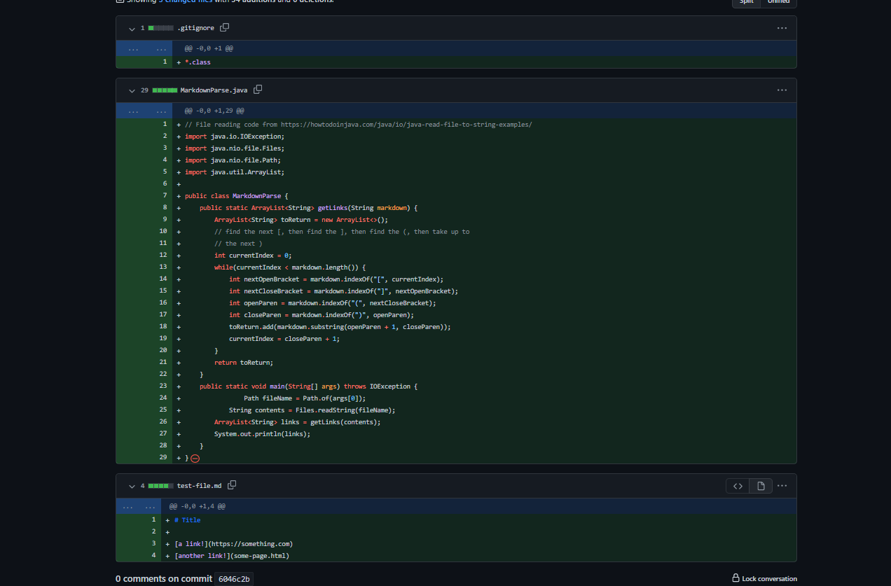
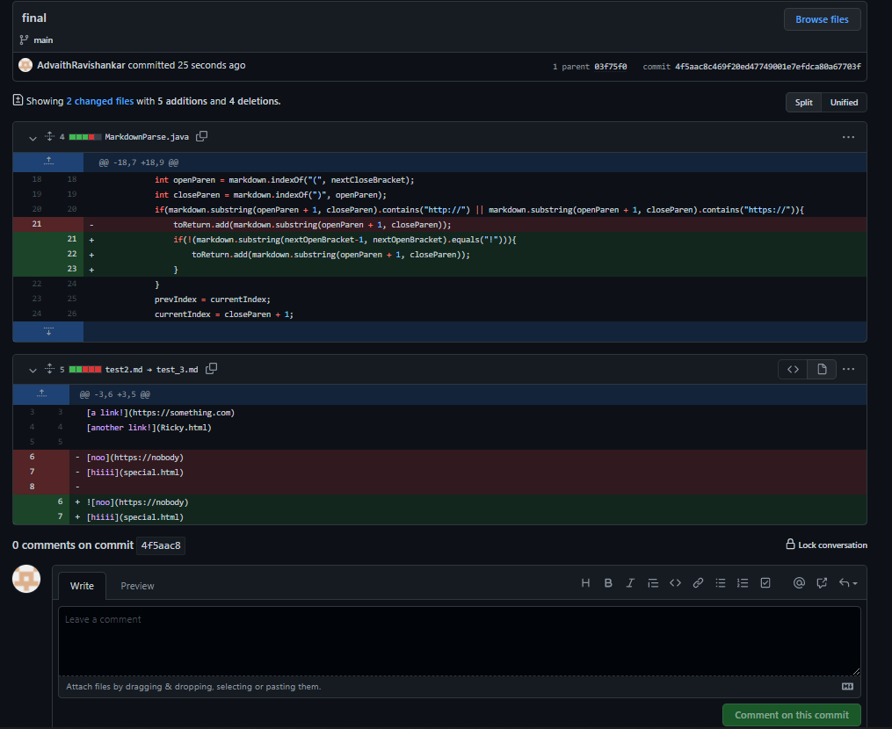

# Lab Report 2 - Debugging MarkdownParse
---
## Original File

the original file can be seen below which was forked:



The purpose of this file was to take an input mardown file and output all the links in the file. In general the file worked fun however, there were some bugs and symptoms with the program that was fixed. This lab report will go over three such changes:

## Test 1 - Masked Links

The first issue encountered in the group discussion was the fact that the program would read all characters in the link format. However, these supposed "links" may not acctaually be a link but some characters. Therefore to fix this symptom, a test file was committed:


When the ```MarkdownParse.java``` file was compiled and run, it lead to the following symptom of the word "hi" being intoduced as a link:


To fix this symptom, we added a condition to check whether it was a web link. The if statement checked whether if it contained ```http:// or https://``` as they were needs in web based urls. The committed file change is as shown:


When this was compiled, the bug of the lacking if statement was fixed. This can be seen below when the code was recompiled:


Therefore, the relationship between the bug and the symptom is that the symptom was caused due to a lack of conditional edge testing of the file. The failure inducing input of a supposed "masked link" caused the issue.

## Test 2 - Extra Line Infinite Loop

Another symptom which was encoutered is when the test file had a blank line at the end of it as shown below:


To see what the symptom is, the follwoing changes are needed to the ```MarkdownParse.java``` file:


When this is compiled and run, an infinite loop is encountered:


To fix this issue, the bug in the code needs to be addressed by adding a conditonal check for repeated loops:


When this is rerun, the symptom is now resolved:


Therefore, the relationship between the bug and the symptom is that the symptom was caused due to a lack of conditional edge testing again. The failure inducing input of a blank ending line caused the infinite loop.

## Test 3 - Imgaes as links

In Markdown, the image format is ``````. This however, does not function as the definitiion of a link. Therefore, to observe this symptom, we use the following test file:


when this is run, the following output is observed:


To fix this, we just need to add another if statment to check if an ```!``` is there to before the ```[``` to address the bug:



When this is rerun, 


The image link no longer appaers. 

Therefore, the relationship between the bug and the symptom is that the symptom was caused due to a lack of conditional edge testing again. The failure inducing input of a ! caused an incorrect program behaviour.

THIS IS THE END OF THE LAB REPORT

