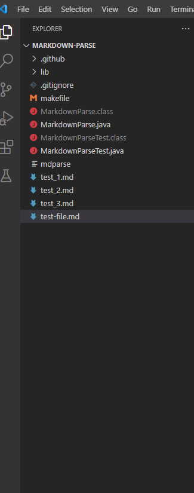
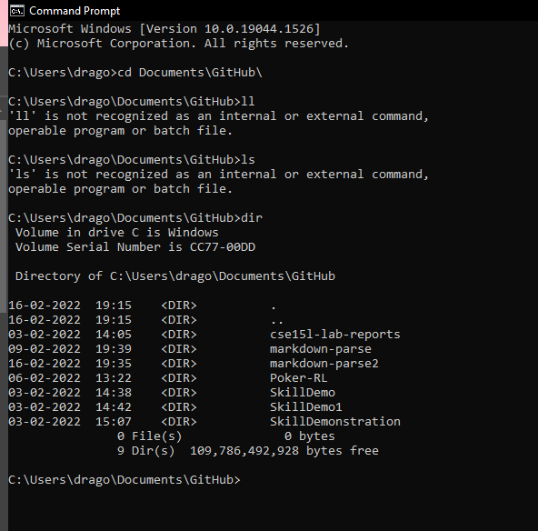
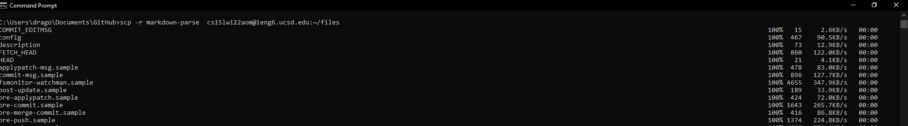
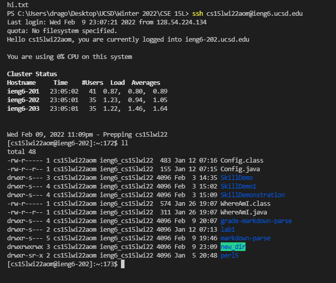
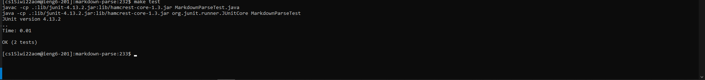

# Lab Report 3 - Uploading An Entire Directory
---

Uploading singular files to a server is a simple process. We can also use the same ```scp``` comand to upload an entire folder, each and every file and sub-dierctory, to a server. However, that repeated ```scp``` is a tad bit too tedious. 

Therefore, this lab report will present a simple process of doing it.

## Step 1. Make Directory

For the purpose of this report, let us create a new directory called ```new_dir``` in a folder. I am using my CSE15L folder for convienence:



Open the folder where ```new_dir``` is located in using VScode.

## Step 2. Creating A Couple of Files

Just as an example, I am creating a large variety of files with a sub-direcotry to show that all files can be uploaded. I used ```.java```, ```.md```, ```makefile```, and ```.txt``` as examples:



This should give us a varity test batches to upload our files.

## Step 3. Upload Files

Open up the terminal and type the following command ```scp -r  new_dir server_location```. This is a generalised statement which will work. On my local system, I ran ```scp -r  new_dir cs15lwi22aom@ieng6.ucsd.edu:~/``` which connects me to the neccessary server.



## Step 4. Checking if Folder and Files Are Uploaded

Now comes the moment of truth. Did it work? To check this, ```ssh``` into your server. I ran the command ``` ssh cs15lwi22aom@ieng6.ucsd.edu```. Now type ```ll``` to see if all files were uploaded:



There seems to be the ```new_dir``` directory in the folder. Let's check if all the files are uploaded. run ```cd new_dir``` followd by ```cd nested_dir``` to check if everything worked.



Voila! Everything has been uploaded. Thank you for reading this lab report

THIS IS THE END OF THE LAB REPORT
