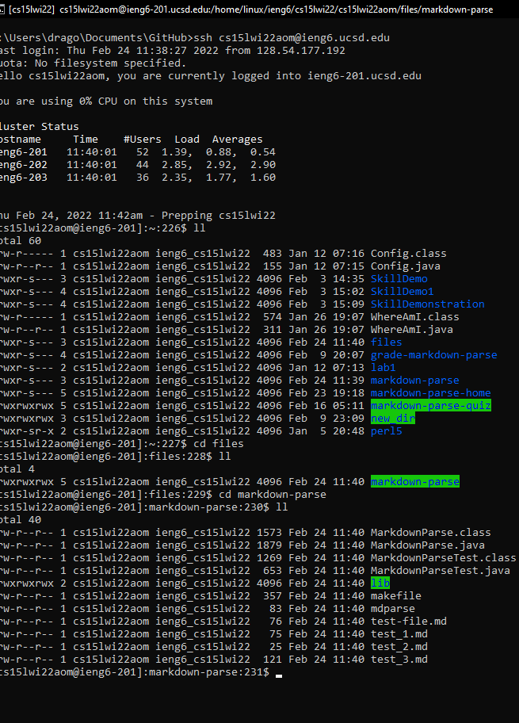

# Lab Report 3 - Uploading An Entire Directory
---

Uploading singular files to a server is a simple process. We can also use the same ```scp``` comand to upload an entire folder, each and every file and sub-dierctory, to a server. However, that repeated ```scp``` is a tad bit too tedious. 

Therefore, this lab report will present a simple process of doing it using ```markdown-parse``` directory.

## Step 1. Choosing the Directroy

For this process, we are using the ```markdown-parse``` directory. The image below shows the directory:


## Step 2. Upload Files

Open up the terminal and type the following command ```scp -r  new_dir server_location```. This is a generalised statement which will work. On my local system, I ran ```scp -r markdown-parse cs15lwi22aom@ieng6.ucsd.edu:~/files``` which connects me to the neccessary server. The following image presents the command being run:


## Step 3. Checking if Folder and Files Are Uploaded

Now comes the moment of truth. Did it work? To check this, ```ssh``` into your server. I ran the command ``` ssh cs15lwi22aom@ieng6.ucsd.edu```. Now type ```ll``` and ```cd``` into the directory to see if all files were uploaded:



There seems to be the ```markdown-parse``` directory in the folder with all the files.

## Step 4. Testing

On the server, let us run the tests. Using the makefile commands, run the Junit test by typing ```make test```.


It looks like the tests ran.

## Step 5. Testing Efficieintly

Now let us try running all these statments in one line. Type ```scp -r markdown-parse cs15lwi22aom@ieng6.ucsd.edu:~/files; ssh cs15lwi22aom@ieng6.ucsd.edu "cd files/markdown-parse; make test"```.


Now all the tests ran in one line. Effiecient don't you think? 

Thank you for reading this lab report

THIS IS THE END OF THE LAB REPORT
