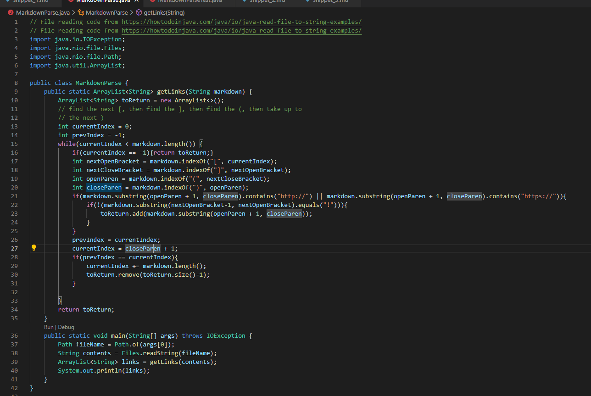

# Lab Report 4 - Testing MarkdownParse
---

## Step 1. The Test Files

For this lab report, we are going to test markdown parse with the follwowing samples of code:

Snippet 1.
```
`[a link`](url.com)

[another link](`google.com)`

[`cod[e`](google.com)

[`code]`](ucsd.edu)

```

Snippet 2.
```
`[a [nested link](a.com)](b.com)

[a nested parenthesized url](a.com(()))

[some escaped \[ brackets \]](example.com)

```

Snippet 3.
```
[this title text is really long and takes up more than 
one line

and has some line breaks](
    https://www.twitter.com
)

[this title text is really long and takes up more than 
one line](
    https://ucsd-cse15l-w22.github.io/
)


[this link doesn't have a closing parenthesis](github.com

And there's still some more text after that.

[this link doesn't have a closing parenthesis for a while](https://cse.ucsd.edu/


)

And then there's more text

```

## Step 2. My MarkDownParse Implementation

The following image represents my implementation of markdown parse:



With these we can run tests.

## Step 3. Testing My Implementation

Find below a screenshot of all the tests we are running:


When this is cloned using the ```git clone``` command and run on the ieng6 server, the following Junit results are seen:


Out of all tests, only the snippet 3 fails.

## Step 4. Other MarkDownParse Implementation
 
 The following image represents the other implementation of markdown parse:


With these we can run tests.

## Step 5. Testing Other Implementation

Find below a screenshot of all the tests we are running:


When this is ```git clone``` commandand run on the ieng6 server, the following Junit results are seen:


Out of all tests, only the snippet 3 fails.


