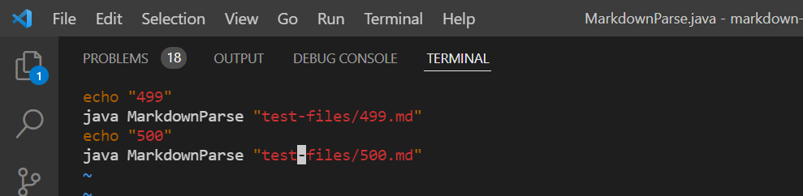
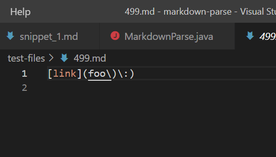
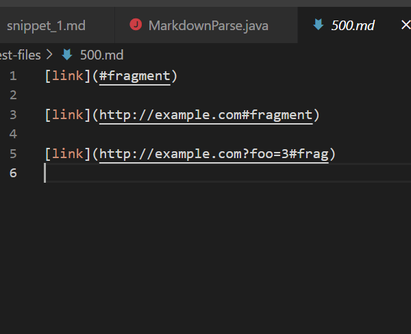
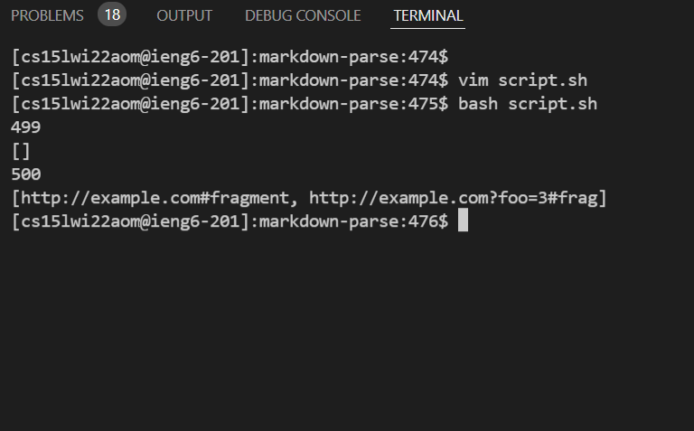
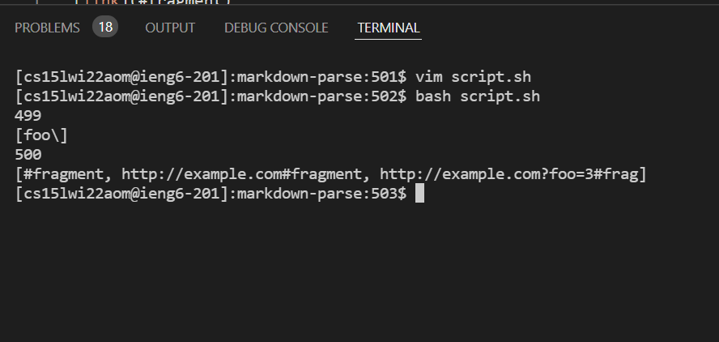
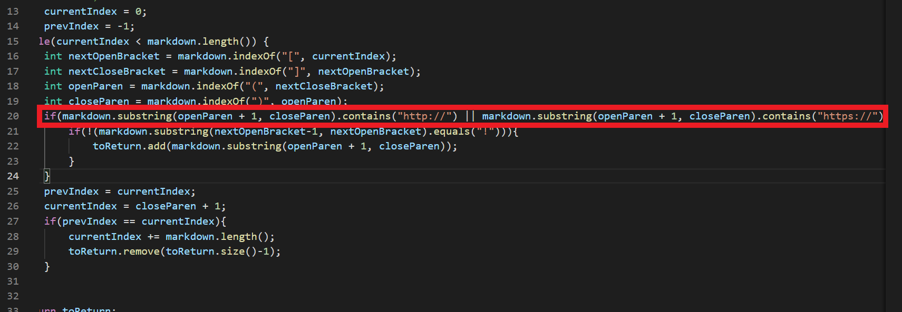
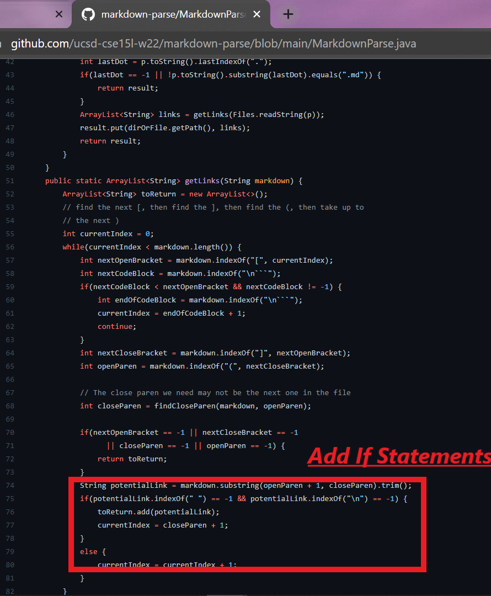

# Lab Report 4 - Testing Files and Comparing Outputs
---

For this Lab report, I am going to compare the results of two tests from the testfiles commonspeck tests directory, in particular 499.md and 500.md [link to tests](https://github.com/ucsd-cse15l-w22/markdown-parse/tree/main/test-files) between [My implementation of markdown-parse](https://github.com/AdvaithRavishankar/markdown-parse) and [the cse15l implementation of markdown-parse](https://github.com/ucsd-cse15l-w22/markdown-parse). I decided to chose these tests by manually seeing all the outputs and checking which ones had a different output between the two implmentations (only 40 or so). I then narrowed it down for presentation by editing the bash script.  

I ran the following bash script to compare the outputs:



These are the contents of the files:

499:



500:



## Step 1. My Implmentation

[Link to repository: AdvaithRavishankar - MarkdownParse](https://github.com/AdvaithRavishankar/markdown-parse)

On the terminal, I ran the ```bash script.sh``` command of the above bash script. I got the following output for each file:




## Step 2. CSE15L Implementation

[Link to repository: CSE15L - MarkdownParse](https://github.com/ucsd-cse15l-w22/markdown-parse)

On the terminal, I ran the ```bash script.sh``` command of the above bash script. I got the following output for each file:



## Step 3. Error fixing

for both tests, ```My Implementation``` is the correct output as 499 has no valid links in the brackets and 500 has only two where the cse15l implementation also shows ```#fragmnet``` which is incorrect.

The issue with both these problems is that the cse15l program takes in any text given in the brackets after a ```[]``` which is not necessarily a link. My code takes into account of this, therefore, it is the correct implementation. Here is a an image of my implementation with the correct solution:



Therefore, to fix this issue an ```if``` statement needs to be added. There are several more if statements to be added to the below cse15l implementation of the markdown parse to be correct. This will lead to several lines of changes to ensure that the cse15l representation of markdown-parse runs correctly for these edge cases:



THIS IS THE END OF THE LAB REPORT

***

[TO GO BACK TO THE HOME PAGE CLICK HERE](https://advaithravishankar.github.io/cse15l-lab-reports/)


