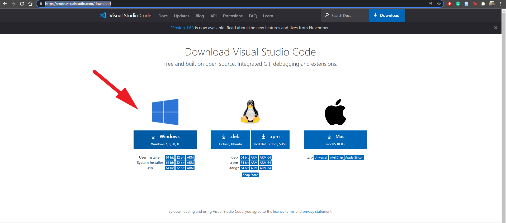
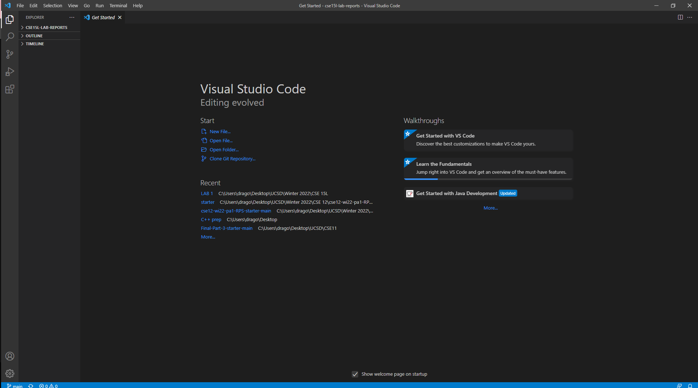

# Week 2 Lab Report 
***
In this lab report, I shall go over the steps on how to set up the environment to access a remote server and running commands on the server. This report will involve 6 steps which can be seen as follows:

## Step 1. Install Visual Studio Code

[Click on here for the link to install Visual Studio.](https://code.visualstudio.com/download) You should See the Website as follows:

Download the version corresponding to your operating system and run it to install visual studio code on your computer. Open VScode using your file explorer and you will see the follwoing window:

