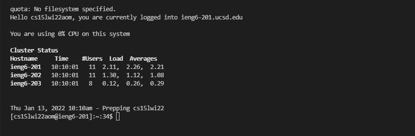
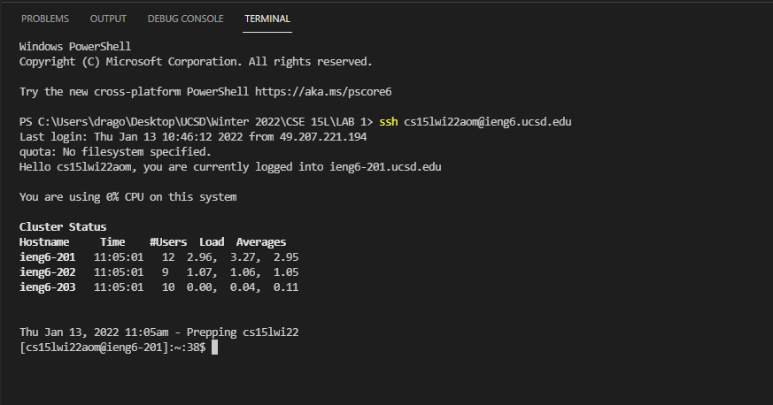
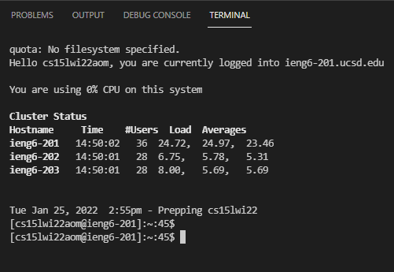

# Week 2 Lab Report - 1
***
In this lab report, I will go over the steps on how to set up the environment to access a remote server and running commands on the server. This report will involve 6 steps which can be seen as follows:

## Step 1. Install Visual Studio Code

[Click on here for the link to install Visual Studio Code.](https://code.visualstudio.com/download) You should See the Website as follows:


Download the version corresponding to your operating system and run it to install visual studio code on your computer. Open VScode using your file explorer and you will see the following window:


## Step 2. Remote Connection

For the purpose of this lab report, I will be connecting to the UCSD engineering lab's servers. This can be done by using your username which is the form ```cs15lwi22zzz@ieng6.ucsd.edu where``` "zzz" is a unique code associated to your account. Contact UCSD for setting the password. After having the username and password, we can now connect to the server.

To connect to the server, the ssh (secure shell) command will be used in the terminal. Open VScode and open the termianl tab. Click on the New Terminal Option as shown below:


This will open a terminal on the bottom of the screen. On the terminal, type: ```ssh cs15lwi22zzz@ieng6.ucsd.edu```. This will connect you to the server, asking you for a password as shown below:


After inputting your password correctly, you will now be connected to the server as shown below:



## Step 3. Running Commands

After connecting to the server, You can try some commands:
1. ```ls``` - lists all the directories on the account
2. ```cd``` - change directory
3. ```exit``` - which disconnects you from the server
4. ```mkdir``` - makes a directory

Running the commands on the terminal leads to the following result:


## Step 4. Moving Files From Client to Server

To move files from the client onto the server, a scp (shell copy) command must be run from the client's terminal. In VScode, create a file called WhereAmI.java with the following content:
```
class WhereAmI {
    public static void main(String[] args) {
      System.out.println(System.getProperty("os.name"));
      System.out.println(System.getProperty("user.name"));
      System.out.println(System.getProperty("user.home"));
      System.out.println(System.getProperty("user.dir"));
    }
  }
 ```

Then, on the terminal, type: ```scp WhereAmI.java cs15lwi22zzz@ieng6.ucsd.edu:~/.``` Your password will be asked and then the file will be uploaded.

Next step, access the terminal as in step 2 and the type the ls command. You will see the WhereAmI.java on the list. Run the javac and java command, resulting in the necessary output.


## Step 5. Setting Up A SSH Key

To make the process of logging into a server easier, a ssh key is used to remove the password authentication process of the connection step. This way by typing the ssh command  logs you into the server automatically.

On the terminal, type: ```ssh-keygen```. This will generate a public private key on your pc and this shoud be saved in a file on your pc.

Then, connect to the server as shown in step 2 and create a new directory called ```.ssh```. Run the command ```mkdir .ssh```.

Exit the server and then copy the ssh key into the .ssh directory by using the ```scp``` command.

command:

```scp publicprivateketfilelocation cs15lwi22zzz@ieng6.ucsd.edu:~/.ssh/authorized_keys```


Now, try connecting to the server using ssh. The following will occur:



## Step 6. Optimization

After setting up the ssh key, the time to log in drastically reduces. However, this can be further optimized by using some shortcuts. For example, instead of typing out javac filname.java and java filename every single time, you can use the up and down arrows to cycle back to previous commands used. This would reduce the time taken to run each iteration of your code to just a couple of seconds:



Another shortcut you can use is running a command on the server by mentioning the server command at the end of the ssh command. For example, upload the same WhereAmI.java file and excecute ```ssh cs15lwi22aom@ieng6.ucsd.edu "javac WhereAmI.java; java WhereAmI"```. When this runs, the file will run directly on the server without you logging in:


This is it for the tutorial, I hope it was helpful.

***

[TO GO BACK TO THE HOME PAGE CLICK HERE](https://advaithravishankar.github.io/cse15l-lab-reports/)


