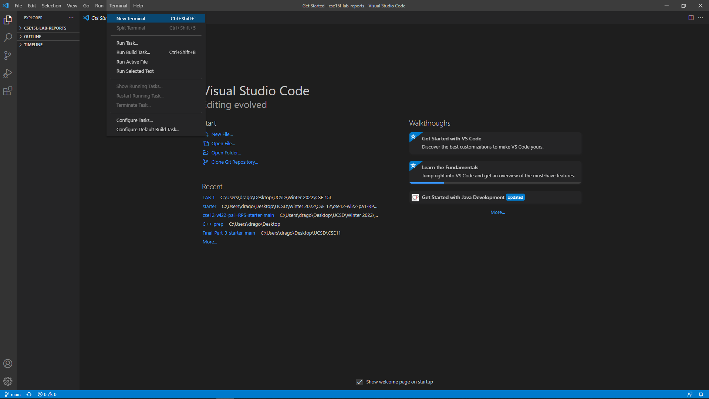
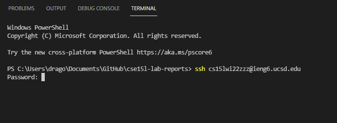
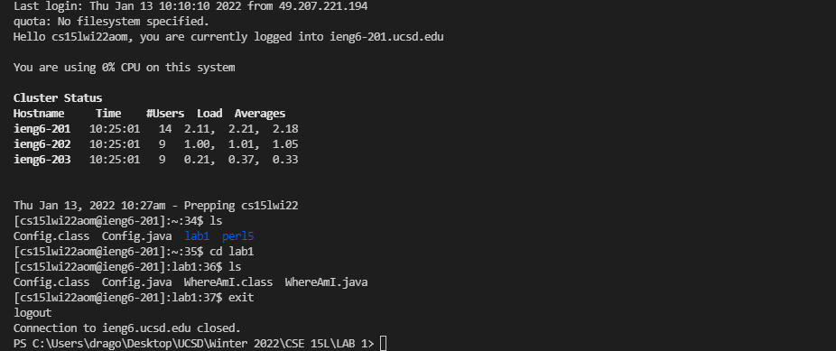
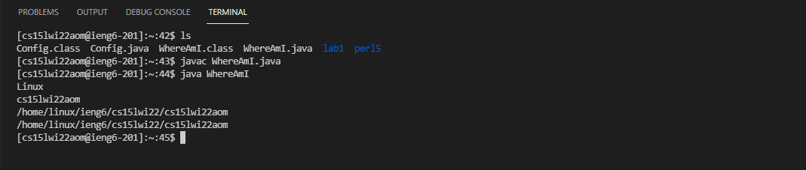

# Week 2 Lab Report 
***
In this lab report, I shall go over the steps on how to set up the environment to access a remote server and running commands on the server. This report will involve 6 steps which can be seen as follows:

## Step 1. Install Visual Studio Code

[Click on here for the link to install Visual Studio Code.](https://code.visualstudio.com/download) You should See the Website as follows:

Download the version corresponding to your operating system and run it to install visual studio code on your computer. Open VScode using your file explorer and you will see the following window:

## Step 2. Remote Connection

For the purpose of this lab report, I will be connecting to the UCSD engineering lab's servers. This can be doen by using your user name which is the form cs15lwi22zzz@ieng6.ucsd.edu where "zzz" is a unique code associated to your account. Contact UCSD for setting the password. After having the username and password, we can now connect to the server.

To connect the server, the ssh (secure shell) command will be used in the terminal. Open VScode and open on the termianl tab. Click on the New Terminal Option as shown below:

This will open a terminal on the bottom of the screen. On the terminal. type: ssh cs15lwi22zzz@ieng6.ucsd.edu . This will connect you to the server, asking you for a password as shown below:

After inputting your password correctly, you will now be connected to the server as shwon below:

## Step 3. Remote Connection

After connecting to the server, I tried some commands:
1. ls - lists all the directories on the account
2. cd - change directory
3. exit - which disconnects you from the server

running the commands on the terminal leads to the following result:

## Step 4. Moving Files From Client to Server

To move files from the client on the server, an scp command must be run from the terminal from the client. In VScode, create a file called WhereAmI.java with the following content:

class WhereAmI {
    public static void main(String[] args) {
      System.out.println(System.getProperty("os.name"));
      System.out.println(System.getProperty("user.name"));
      System.out.println(System.getProperty("user.home"));
      System.out.println(System.getProperty("user.dir"));
    }
  }

Then, on the terminal, type: scp WhereAmI.java cs15lwi22zzz@ieng6.ucsd.edu:~/. Your password will be asked and then the file will be uploaded.

Next step, access the terminal as in step 2 and the tyoe the ls command. You will see the WhereAmI.java on the list. Run the javac and java command, resulting in the necessary output.

